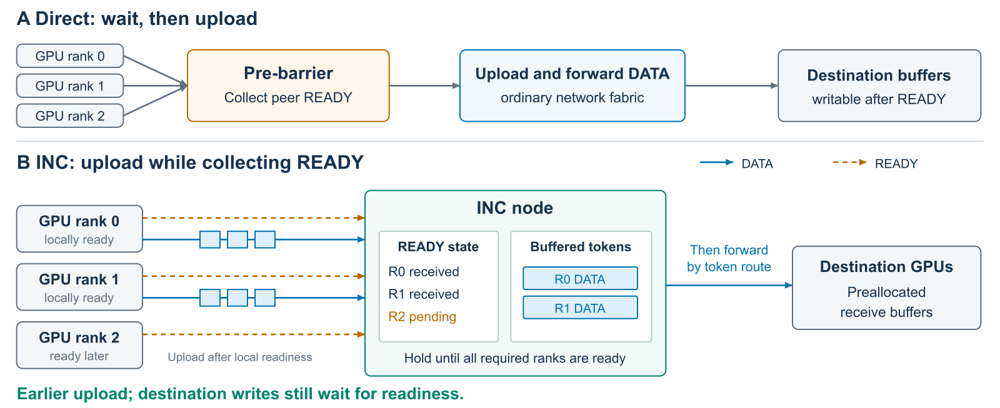
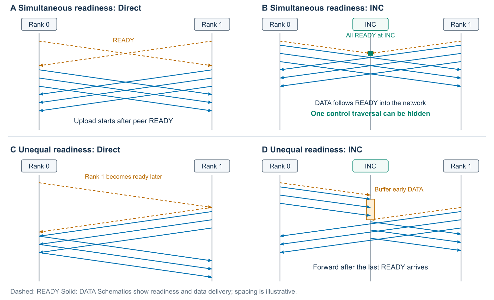

# Overlapping MoE Pre-Barriers with Data Transfer Using In-Network Computing

> 主线：rank 本地就绪后先上传，INC 同时收集 READY 并暂存早到数据；接收条件满足后转发，把等待其他 rank 就绪的时间用于搬运数据。

## 1. Introduction — 引言

- **问题**：小 batch 缩短 token 传输，但 pre-barrier 仍需等待同一组 rank，开销难以摊薄。
- **观测**：H200 跨机 EP8 Direct 的 pre-barrier 约 15 µs，小 batch 时约占算子 20%；真实跨机 decode 中约占 GPU step 的 15%–17%。
- **思想**：将“开始上传”和“允许写入目标 buffer”分开。INC 汇总 READY 的同时接收数据，就绪后转发。
- **贡献**：pre-barrier 开销测量、提前上传协议，以及完整通信操作的时延分析。

## 2. Background and Motivation — 背景与动机

### 2.1 Expert-Parallel Communication

介绍 Dispatch → expert compute → Combine。路由决定 token 的目标，计数和布局元数据决定接收后的组织方式。READY 表示本轮通信所需资源可用。

典型发送前协调方式：NCCL EP HT 先汇总路由；DeepEP V2 Direct 先执行 pre-barrier，再并行处理计数与数据；NCCL EP LL 向预留槽位写入并使用细粒度信号。

### 2.2 Pre-Barriers in DeepEP V2 Direct

Direct 已采用 GPU 发起传输和预分配接收 buffer。Dispatch 由不同 warps 并行处理计数／布局和 token 传输，Combine 复用 Dispatch 建立的路由。

这些传输在 pre-barrier 之后开始：每个 rank 等待参与者就绪并完成本地同步，因此本地已有 token 也不能提前发送。固定 EP8，T/rank 从 8 增至 128 时，pre-barrier 约保持 15 µs，占比从约 20% 降至约 5%。由此引出在收集 READY 时先上传本地数据的机会。

### 2.3 Opportunities for In-Network Computing

INC 可在转发时维护哪些 rank 已就绪，并暂存早到 token。所有相关通信经过 INC 时，可将上传与 READY 汇总并行组织。

**Key Insight**：本地数据就绪后即可上传到网络暂存区，目标写入仍等待所需就绪条件。这样 pre-barrier 的等待过程可以与部分数据传输重叠。

## 3. Design — 设计

### 3.1 Protocol Overview

INC 为每轮维护 READY bitmap 和有上限的数据队列。generation 标识一次 Dispatch/Combine，epoch 区分接收 buffer 的不同轮使用。相关参与者及数据路径需纳入相同的就绪判定范围。

接收 buffer 在初始化时按 symmetric memory 分配、注册，布局和访问映射一次性建立。token 路由和标识决定目标及写入偏移，不依赖全局计数。READY 确认本地输入可用，且目标 buffer 已结束上一轮使用。

### 3.2 Overlapping Readiness Collection with Upload

rank 发布 READY 后开始上传，不等其他 rank 的 READY 返回。READY 携带 rank、generation、epoch；路由随 token 传输，必要计数和元数据按原通信流程处理，不把完整 count vector 作为 READY 的前置条件。

INC 忽略重复和旧轮次消息。所需 READY 未收齐时暂存 DATA；就绪且目标可写后，按路由转发缓存和新到 token。Dispatch 接收后按 expert 整理；Combine 将 expert outputs 送回 token owner 完成合并。

### 3.3 Buffer Reuse and Flow Control

接收 buffer 的最后一次读取完成后才可复用，下一轮 READY 确认这一点。发送 buffer 保留到发送硬件读完。INC 在队列排空且所有 rank 进入下一轮后回收旧轮 READY 状态。

PFC 在缓存溢出前暂停 DATA，并预留 headroom 接纳暂停生效前的在途数据。READY 与必要控制元数据有独立优先级和预留资源，避免暂停 DATA 时阻塞就绪消息。

## 4. Latency Analysis — 时延分析

### 4.1 Communication Latency Model

完整 Dispatch/Combine 分为 READY、DATA、post-barrier。DATA 包含进入后同步前必需的发送侧工作；后同步项包含本地收尾。

**T_base = T_ready + T_data + T_post。**

借鉴 Swift 区分处理与网络时延，在参与者同时就绪的参考条件下：

**T_ready = T_issue + L + T_observe。**

T_issue 是本地准备并发出 READY 的时间；L 是 READY 的单向网络传播；T_observe 是接收后检查信号与完成本地同步的时间。

### 4.2 Latency Reduction from Early Upload

INC 保留本地发起工作，随后让 DATA 上传与 READY 传播重叠；目标写入仍等就绪条件满足。在参考数据传输和后同步工作相同的条件下：

**T_INC = T_issue + T_data + T_post + T_extra。**

T_extra 包括仍需执行的就绪处理及额外缓存／放行等待。DATA 自身的源到目标传播已包含在 T_data 中。

**收益 ΔT = L + T_observe − T_extra。**

网络部分的参考收益是 L：对称路径下约半个网络 RTT。其含义不是整个实测 pre-barrier 时长的一半，净收益还取决于观察工作和新增处理成本。

### 4.3 Overlap with Unequal Readiness

实际运行中，计算与调度差异使 rank 常常错峰就绪。Figure 2(C–D) 中早到 rank 在等待期间上传，最后一个 READY 到达后，INC 可直接转发缓存中的 token，无需再等源端接收 peer 信号后才启动上传，因此机制不依赖同步到达。

暂存和转发能力充足时，这一上传提前量能在错峰场景中保留；若提前了关键路径上的数据交付，就能缩短完整操作。出口排队和 PFC 的额外等待计入 T_extra，收益大小随到达时序及最后完成的 rank 而变化。

## 5. Evaluation — 实验评估

回答三个问题：pre-barrier 如何随 token 数变化、在不同 EP 配置中是否持续存在，以及它在真实 MoE serving step 中占多大比例。

### 5.1 Experimental Setup and Methodology

- 两台 H200，各八卡；机内 NVSwitch，机间八轨 400GbE RoCE。Direct、GDAKI3、TC162。
- 微基准：H=7168、topk=8、E=256、BF16、balanced/uniform。每点三轮独立进程，每轮 200 次有效迭代。
- 每次选 pre-barrier 最短的 rank，除以同 rank 同轮 trace-on 算子时间；该口径减少慢 rank 到达差的影响，但选中 rank 仍可能等待。误差为三轮均值的样本标准差。
- EP8 token sweep 与 EP-size 表来自不同采集批次；表格常数只拟合表中列出的点。
- 同镜像 EP8/T8 on/off 检查中，Dispatch 总时延差 3.9%–5.0%，Combine 为 1.7%–3.8%；阶段占比使用同次 trace-on 分子与分母。
- 推理每个 client 窗口采样一个 active GPU step。decode 每个活跃 rank 均采样；prefill 只统计实际执行的 active step。

### 5.2 Effect of Token Count

H200 跨机 EP8 Direct：

| T/rank | Dispatch pre-barrier 占比 | Combine pre-barrier 占比 |
|---:|---:|---:|
| 8 | (20.57 ± 0.06)% | (19.84 ± 0.13)% |
| 32 | (12.25 ± 0.17)% | (12.26 ± 0.26)% |
| 64 | (8.29 ± 0.51)% | (8.20 ± 0.16)% |
| 128 | (4.88 ± 0.04)% | (5.05 ± 0.19)% |

四档绝对时长均约 15 µs；固定的就绪成本在小 token batch 下最难摊薄。来源：[配对数值](../data/h200/numbers/PAIRED_CONTROL_SHARE.md)；[主图源码](../figures/entry-cost.tex)。

### 5.3 Pre-Barrier Cost across EP Sizes

各固定 EP 配置的常数估计使用全部所列 token 档，每档三轮：

| EP 卡数 | T/rank | Dispatch (µs) | Combine (µs) | 各档均值最大偏差 (µs) |
|---:|:---|---:|---:|---:|
| 4 | 8/32/96/128 | 11.65 | 11.54 | 0.06 |
| 8 | 8/32/64/96/128 | 14.96 | 14.94 | 0.16 |
| 16 | 8/32/96/128 | 18.36 | 18.28 | 0.09 |

pre-barrier 均值从 EP4 的约 11.6 µs 增至 EP16 的约 18.3 µs；每个 EP 配置内部，各 token 档的均值变化不超过 0.16 µs。每机卡数、目标分布和网络并发随 EP 配置共同改变，数值反映其综合效果。来源：[拟合数值](../data/h200/numbers/PRE_MIN_FITS_T64.md)。

### 5.4 Pre-Barrier Share in MoE Inference

Qwen3-30B-A3B，BF16、TP1/EP8 Direct，实际路由。这里的占比是一个 sampled GPU step 内 48 次 Dispatch 与 48 次 Combine 的 pre-barrier 累计时间；不同于 §5.2 的单算子占比。

| 拓扑 | 并发 | 实测 token/rank | D+C pre-barrier 占 GPU step |
|:---|---:|---:|---:|
| 单机 1n8 | 1 | 1 | (9.26 ± 0.15)% |
| 单机 1n8 | 64 | 8 | (9.33 ± 0.12)% |
| 单机 1n8 | 128 | 16 | (7.94 ± 0.15)% |
| 单机 1n8 | 256 | 32 | (7.61 ± 0.32)% |
| 跨机 2n4 | 64 | 8 | (16.72 ± 0.10)% |
| 跨机 2n4 | 128 | 16 | (15.19 ± 0.05)% |

C1 是低负载锚点，每个窗口只有一个 active rank；三个 client 窗口复用同一 server 实例。

扩展跨机对照：

| EP | 工作负载 | T/rank | pre-barrier 占 GPU step |
|---:|:---|---:|---:|
| 4 | Decode C64 | 16 | (14.75 ± 0.21)% |
| 8 | Decode C128 | 16 | (15.19 ± 0.05)% |
| 16 | Decode C256 | 16 | (15.04 ± 0.12)% |
| 8 | Prefill | 512 | (2.64 ± 0.06)% |
| 8 | Prefill | 2048 | (3.13 ± 0.39)% |

**Request concurrency.** 低并发只激活部分 rank；C16 起两种拓扑都激活 8 个 rank。C16–C256，单机占比从 14.91% 降至 7.61%，跨机从 18.73% 降至 14.22%。\n\n**EP scale and workload.** 相同 16 token/rank 下，跨机 EP4/8/16 均约为 15%；512/2048 token 的 prefill 占比为 2.6%–3.1%。大 token batch 更充分地摊薄了重复的 READY 开销。来源：[扩展汇总](../data/h200/numbers/e2e_prebarrier_expanded.json)、[原始汇总](../data/h200/20260912/cross_e2e/)；[主图源码](../figures/inference-share.tex)。

## 6. Related Work — 相关工作

### 6.1 EP Communication

[DeepEP](https://github.com/deepseek-ai/DeepEP) 与 [NCCL EP](https://arxiv.org/abs/2603.13606) 提供 EP 数据路径与不同发送前协调方式。[SwiftEP](https://www.usenix.org/conference/nsdi26/presentation/li-xingyi)、[Perseus](https://arxiv.org/abs/2605.00686)、[UBEP](https://arxiv.org/abs/2607.06202) 改进数据移动和传输过程中的协调。本文用网络暂存重叠发送前的就绪等待。

### 6.2 In-Network Computation

[SHARP](https://developer.nvidia.com/blog/advancing-performance-with-nvidia-sharp-in-network-computing)、[SwitchML](https://www.usenix.org/conference/nsdi21/presentation/sapio) 展示网内归约与状态管理；[DySHARP](https://arxiv.org/abs/2605.05607)、[MultiWrite](https://arxiv.org/abs/2605.22428) 将网络处理用于 MoE 数据交换。本文利用临时状态和缓存改变 pre-barrier 与上传的先后关系。

### 6.3 Synchronization and Delay Analysis

[EPIC](https://arxiv.org/abs/2605.18683) 的 INC 协议和资源抽象、[GPU-Initiated Networking](https://arxiv.org/abs/2511.15076) 的端点原语为实现提供基础。[Swift](https://doi.org/10.1145/3387514.3406591) 提供处理/网络时延分解思路，[FabricPerf](https://github.com/open-neutrino/fabricperf) 强调明确的计时边界。

## 7. Conclusion — 结论

小 batch 下 pre-barrier 开销显著。INC 允许本地就绪的 rank 在等待期间提前上传，并在接收条件满足后转发。收益取决于暂存空间、就绪时间差和转发速率。
