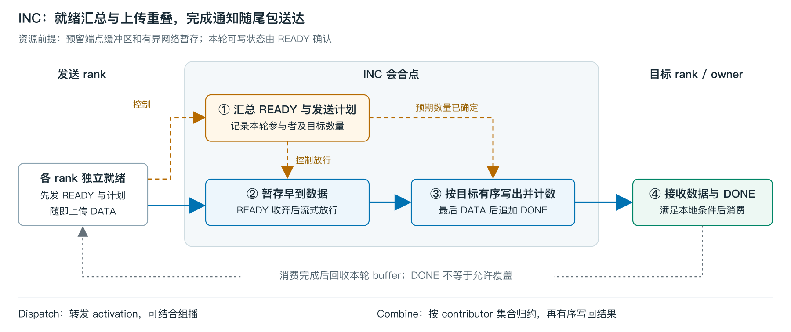
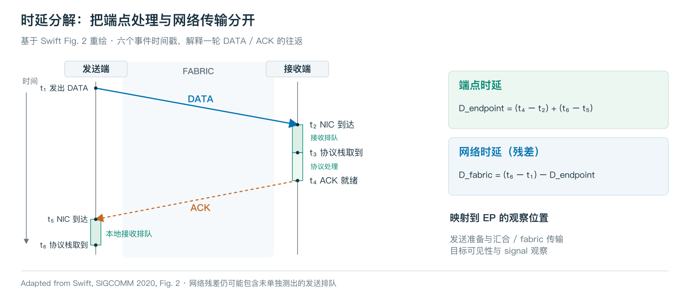
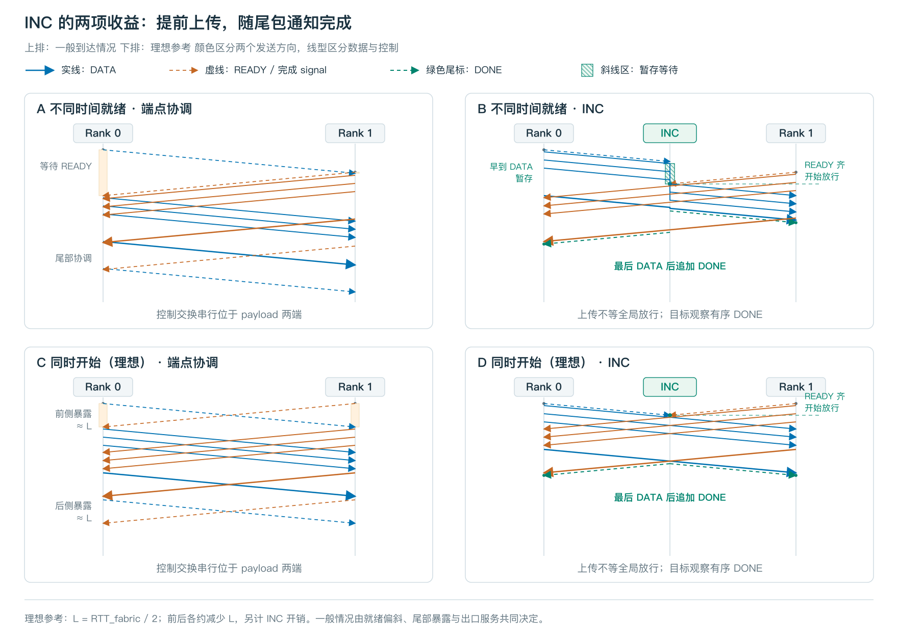

# Overlapping MoE Synchronization and Data Transfer with In-Network Computing

> 主线：在具有入口与尾部协调的 EP 路径上，将 READY 汇总与数据上传重叠，并在目标数据输出完成后生成有序 DONE，减少控制等待在关键路径上的暴露。

## 1. Introduction — 引言

- **问题**：小 batch 缩短了 payload 阶段，但跨 rank 协调的成本不会等比例下降。
- **研究场景**：DeepEP V2 跨机 Direct Dispatch/Combine，具有 pre-barrier 和发送收尾之后的全 EP 完成信号交换。
- **方法**：rank 本地就绪后上传至 INC 暂存；INC 汇总 READY 后放行，并在逐目标尾包后追加 DONE。
- **贡献**：基线同步测量、网内协调设计及其时延分析。引言用一个真实推理结果说明动机，完整数据放在 §5；当前没有 INC 原型加速测量。

## 2. Background and Motivation — 背景与动机

### 2.1 Expert-Parallel Communication

说明 Dispatch → expert compute → Combine；定义 token、rank、topk 和路由。路由决定各目标的数据量，通信 staging 提供落点，最终 expert 布局可依赖 count 交换。

rank 通过集合操作或点对点写入与轮询，交换路由、计数及就绪/完成信息。典型组织方式包括：NCCL EP HT 先汇总路由再传数据；DeepEP V2 Direct 先做就绪同步，再将计数处理与数据传输并行；LL 利用预留槽位和细粒度信号，无需独立 pre-barrier。这些路径都需保证接收资源可写、数据对消费者可见及 buffer 安全复用。

### 2.2 Synchronization in DeepEP V2 Direct

跨机 Direct 的路径：pre-barrier → DATA 与元数据处理 → 发送收尾及本地汇合 → 全 EP post-barrier 信号交换。本文聚焦这条路径，保留资源可写、数据可见和 buffer 安全复用的要求。

固定 EP 规模时，token 减少会缩短 payload，却不减少参与协调的 rank。EP8 pre-barrier 约 15 µs，占比从 T/rank=8 时的约 20% 降至 T=128 时的约 5%，说明小 batch 下有必要减少暴露的同步开销。

### 2.3 Opportunities for In-Network Computing

**INC 背景**：网内计算支持数据路径上的状态维护与聚合，已用于集合归约和 MoE 通信。本文进一步利用有容量保障的暂存与保序通知能力处理同步。

**优化机会**：本地就绪后先上传，INC 同时汇总 READY；目标可写且所需条件满足后放行。INC 跟踪目标输出，在尾数据后追加有序完成通知，保证通知可见时数据已可见；真正的全局依赖仍保留。

**Key Insight**：同步条件必须满足，但同步通信可以与数据传输重叠：上传时汇总就绪，尾数据携带完成通知，从而减少关键路径上的同步等待。

## 3. Design — 设计

### 3.1 Overview and Assumptions

INC 节点维护本轮参与者、逐目标流量计划、输出进度、目标内存描述符和有上限的暂存。受其完成判定覆盖的数据必须经过该节点；多 rail 和本地 bypass 需要明确的完成域与汇合。

上传前获得网络暂存额度；写出前目标本轮 staging 必须可写。实现需要可编程存储和理解传输保序语义的输出接口，现阶段不假定商用交换机仅靠 packet buffer 就能完整承载。

### 3.2 Readiness Aggregation and Early Upload

rank 本地就绪后发送 READY 和流量计划，随后上传已准入 DATA。INC 缓存早到数据，所需 READY 和目标写入条件满足后，按出口能力放行。就绪依赖仍存在，但源到 INC 的传输可以提前进行。

Dispatch 的 count/layout 处理可与写入已预留 staging 重叠；组播可结合使用，其带宽收益不作为同步贡献。

### 3.3 Completion Notification

每个 source 封定本轮发往目标的唯一记录数，零流量也需显式说明。INC 在完整输出后追加 DONE，并保证：

**目标观察到 DONE ⇒ 本轮覆盖的全部数据已对目标 GPU 可见。**

计数必须排除重传重复；跨 QP/rail 的完成域需要汇合。逐目标 DONE 仅在目标本地输入完成足以释放后继计算时替代全局尾协调；真正的全局依赖仍保留。

Combine 复用 Dispatch 的 contributor 集合，按 route-slot 区分贡献，执行既有网内归约，再跟踪 reduced result 的输出完成。归约算术及节省流量的机制沿用前作。

### 3.4 Buffer Management and Progress

generation/epoch 隔离各轮资源。DONE 允许消费；最后一个消费者结束后才允许复用。发送端仍需保证 transport 不再读取源 buffer。

容量覆盖早到数据、进出速率失配和归约 accumulator。容量不足时同路背压；READY 等控制消息必须有独立进展保证。PFC 不能替代容量准入与死锁分析，也不保证压力下吞吐不变。

## 4. Latency Analysis — 时延分析

### 4.1 Delay Model

借鉴 [Swift](https://doi.org/10.1145/3387514.3406591) 的端点/fabric 分解，定义本地就绪、DATA 注入、目标数据可见和消费者释放时刻。实测 barrier 包含端点处理和等待，不能直接等同于网络 RTT。

### 4.2 Overlapping the Pre-Barrier

先讨论各 rank 不同时就绪的一般情况：基线等自己与 peer 就绪后才发送，INC 允许已准入的源先上传，目标写入仍等 READY 和目标资源到齐。暂存、慢 rank 和出口服务共同决定完成时间，不能将提前上传量直接换算为加速。

### 4.3 Overlapping the Post-Barrier

将发送端收尾完成、目标数据可见、完成通知被观察作为不同事件。对比同一目标的释放时刻：

**尾部净收益 = 基线消费者释放时间 − INC 消费者释放时间。**

窄 signal 窗口并未直接测得“数据可见之后仍暴露的等待”。新增通知、保序、排队或确认往返都要计入成本。同步到达且两边各有一次单向控制传播的理想特例，机会约为一个 fabric RTT 减去新增开销；只作为参考，不代替一般路径分析。

## 5. Evaluation — 实验评估

本章测量基线的同步开销及其在推理中的影响；INC 的端到端收益仍需实现后评估。

### 5.1 Experimental Setup and Methodology

- H200：两台各八卡，机内 NVSwitch，机间八轨 400GbE RoCE；跨机使用 GDAKI3/TC162，DeepEP V2 Direct。
- 微基准：H=7168、topk=8、E=256、BF16、balanced/uniform。每档三次独立进程、每次 200 次有效迭代；post-barrier T=32 合并两批共六轮。
- 每次迭代取该阶段耗时最短的 rank；占比除以该 rank 同次 trace-on 算子时长。均值误差表示轮间标准差，不把不同 rank 的阶段占比相加。
- 总算子时延来自 trace-off，阶段来自 trace-on。推理的 GPU-step 占比使用同 rank/step 配对并跨 rank 平均，与微基准 rank-min 统计不同。
- 实测使用通信插桩；推理还含 expert-padding 正确性修复。所有数值均为已有软件基线观测。

### 5.2 Pre-Barrier

主图同时展示 pre-barrier 绝对时长和算子占比。EP8 的 pre-barrier 维持约 15 µs，占比随 T 增大而下降。

| T/rank | Dispatch pre-barrier 占比 | Combine pre-barrier 占比 |
|---:|---:|---:|
| 8 | (20.57 ± 0.06)% | (19.84 ± 0.13)% |
| 32 | (12.25 ± 0.17)% | (12.26 ± 0.26)% |
| 64 | (8.29 ± 0.51)% | (8.20 ± 0.16)% |
| 128 | (4.88 ± 0.04)% | (5.05 ± 0.19)% |

各固定 EP 配置下对可用 T 档作常数描述；所有列出的点参与估计，不再称为独立预测验证。

| EP 卡数 | 参与估计的 T/rank | Dispatch (µs) | Combine (µs) | 各档均值最大偏差 (µs) |
|---:|:---|---:|---:|---:|
| 4 | 8/32/96/128 | 11.65 | 11.54 | 0.06 |
| 8 | 8/32/64/96/128 | 14.96 | 14.94 | 0.16 |
| 16 | 8/32/96/128 | 18.36 | 18.28 | 0.09 |

EP8 的 T=64 是后续不同插桩批次补测。不同 EP 配置也改变每机卡数与网络并发，不据此外推任意 rank 数的规律。来源：[配对数值](../data/h200/numbers/PAIRED_CONTROL_SHARE.md)、[pre-barrier 常数记录](../data/h200/numbers/PRE_MIN_FITS_T64.md)；[主图源码](../figures/entry-cost.tex)。

### 5.3 Post-Barrier

此处 post-barrier 数据仅指信号交换窗口：从本地发起信号到收齐全部预期信号，排除此前的 flush 和本地汇合。保留轮间波动，不再展示宽 post 拟合。

| T/rank | Dispatch post-barrier (µs) | Combine post-barrier (µs) |
|---:|---:|---:|
| 8 | 13.97 ± 0.04 | 13.56 ± 0.24 |
| 16 | 13.98 ± 0.23 | 13.78 ± 0.18 |
| 32 | 11.67 ± 0.94 | 11.70 ± 1.43 |
| 64 | 11.81 ± 0.42 | 11.76 ± 0.29 |
| 96 | 11.12 ± 0.22 | 11.24 ± 0.92 |
| 128 | 11.73 ± 0.07 | 11.88 ± 0.18 |

T=8/16 约为 14 µs，已测 T≥32 约为 11–12 µs；T=32 的慢轮次全部保留。固定 EP8 时信号数量不随 T 改变，但窗口仍可能受 peer 就绪差、端点和网络排队影响。尚无证据支持协议阈值或通用时延公式，也不能将窗口全部计为 INC 收益。来源：[复测与代码分析](../data/h200/numbers/SIGNAL_SYNTHESIS_20260914.md)；[主图源码](../figures/completion-cost.tex)。

### 5.4 Synchronization in MoE Inference

Qwen3-30B-A3B，BF16，EP8 Direct，decode 输入/输出各 128 token。比较同一 EP 规模和并发下的单机与跨机 pre-barrier 占比。

| 拓扑 | 并发 | 实测 token/rank | D+C pre-barrier 占 GPU step |
|:---|---:|---:|---:|
| 单机 1n8 | 64 | 8 | 9.33% |
| 跨机 2n4 | 64 | 8 | 16.72% |
| 单机 1n8 | 128 | 16 | 7.94% |
| 跨机 2n4 | 128 | 16 | 15.19% |

跨机约 15%–17%，单机约 8%–9%。这是采样 GPU step 的占比，不是请求延迟或 INC 加速上限；三次 client 窗口复用服务实例，未测真实模型中 post-barrier signal 窗口的逐层占比。来源：[端到端数值](../data/h200/numbers/E2E.md)、[pre-barrier 分项](../data/h200/numbers/outline_shares.json)；[主图源码](../figures/inference-share.tex)。

## 6. Related Work — 相关工作

### 6.1 EP Communication

[DeepEP](https://github.com/deepseek-ai/DeepEP)、[NCCL EP](https://arxiv.org/abs/2603.13606) 提供基线及不同同步组织；[SwiftEP](https://www.usenix.org/conference/nsdi26/presentation/li-xingyi)、[UEP](https://www.usenix.org/conference/osdi26/presentation/mao-ziming-uep)、[Perseus](https://arxiv.org/abs/2605.00686)、[UBEP](https://arxiv.org/abs/2607.06202) 分别从传输、可移植接口或流水内同步等方向优化 EP。比较其处理的依赖与本文的网络 READY 汇总、暂存放行、目标完成通知，避免反复逐篇否定。

### 6.2 In-Network Computation

[DySHARP](https://arxiv.org/abs/2605.05607)、[MultiWrite](https://arxiv.org/abs/2605.22428) 提供 MoE multicast/reduction 与写语义；[SHARP](https://doi.org/10.1109/COMHPC.2016.006)、[SwitchML](https://www.usenix.org/conference/nsdi21/presentation/sapio) 提供集合卸载与归约状态管理先例。本文借用这些数据面能力，贡献集中在协调时序。

### 6.3 Synchronization Offload

[EPIC](https://arxiv.org/abs/2605.18683) 提供 INC 协议与资源抽象；[GPU-Initiated Networking](https://arxiv.org/abs/2511.15076) 提供 PUT/signal/fence 等端点原语。比较控制状态放置位置及完成语义。Swift 和测量工具在相应方法处引用，不另设一组重复介绍。

## 7. Conclusion — 结论

跨机 Direct 的同步成本在小 batch 下占比显著。本文提出通过网内就绪汇总和有序完成通知重叠两端协调，并给出所需的可见性、资源与进展条件。现有实验支撑问题动机，实际收益仍需 INC 实现验证。
